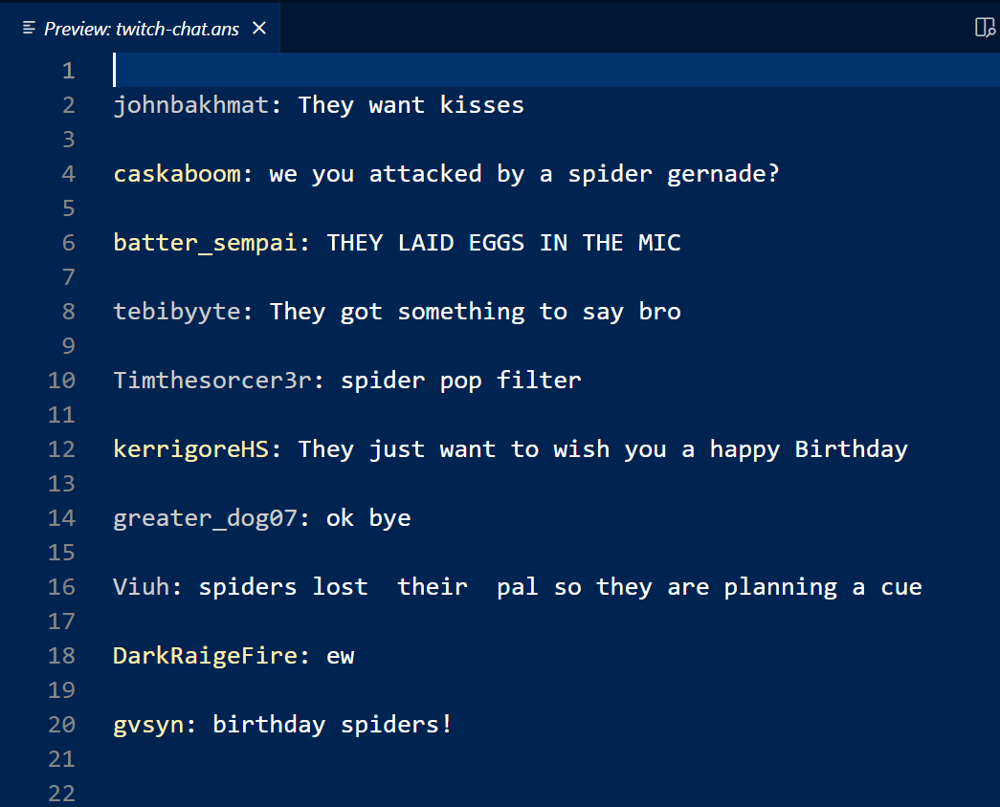

# Better Twitch Chat Viewer

This extension allows you to view Twitch chat directly in VS Code while you're coding. With some extra fun stuff.

## Features

- View live Twitch chat in a VS Code editor window
- Color-coded usernames for different user types (mod, subscriber, regular)
- Emote replacement with 🅱️
- Theme switching command (!theme) available in chat

## Setup

1. Install the extension
2. Open your VS Code settings (File > Preferences > Settings)
3. Search for "Twitch Chat" and set your Twitch username
4. Open a workspace (can be a new folder or your current project folder)
5. Use the command palette (Ctrl+Shift+P) and type "Twitch Chat" to start the viewer

## Usage

Once the chat viewer is open, you'll see live chat messages appear in the editor.

Special commands:
- Type !theme in chat to randomly switch the VS Code color theme

## Requirements

- An active Twitch account
- Open workspace in VS Code
- Ansi extension that should install when you install this extension

## Known Issues

[List any known issues or limitations]

## Release Notes

### 1.0.0

Initial release of VS Code Twitch Chat Viewer

Subscribe to bryanthaboi https://youtube.com/@bryanthaboi

Join the discord to reccomend new chat commands https://bois.icu
